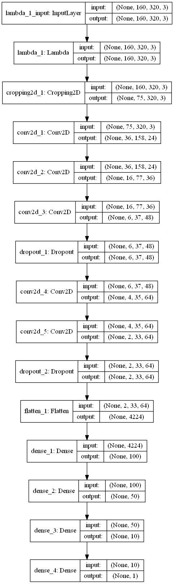
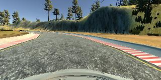
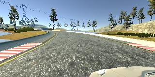
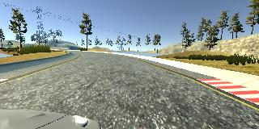
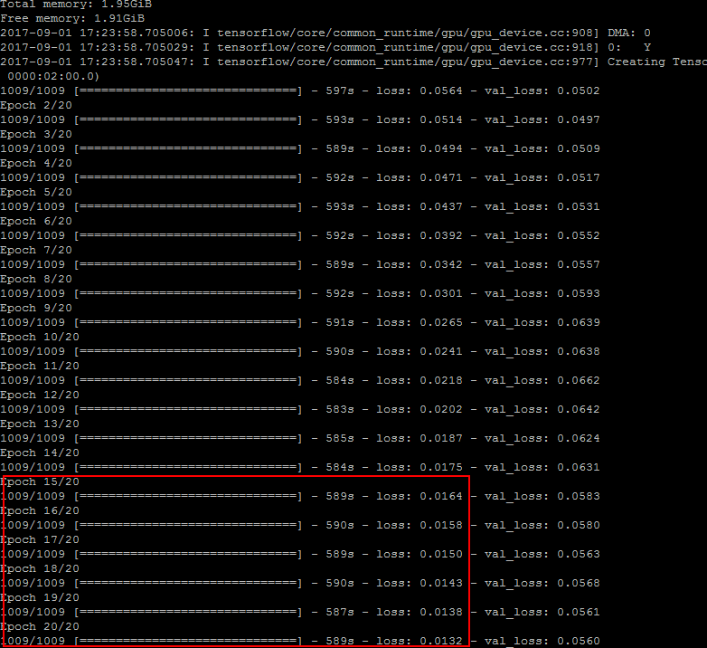

# **Behavioral Cloning Project**

The goals / steps of this project are the following:
* Use the simulator to collect data of good driving behavior
* Build, a convolution neural network in Keras that predicts steering angles from images
* Train and validate the model with a training and validation set
* Test that the model successfully drives around track one without leaving the road
* Summarize the results with a written report

---
### Files Submitted & Code Quality

#### 1. Submission includes all required files and can be used to run the simulator in autonomous mode

My project includes the following files:
* model.py containing the script to create and train the model
* drive.py for driving the car in autonomous mode
* model.h5 containing a trained convolution neural network 
* writeup.md summarizing the results

#### 2. Submission includes functional code
Using the Udacity provided simulator and my drive.py file, the car can be driven autonomously around the track by executing 
```sh
python drive.py model.h5
```

#### 3. Submission code is usable and readable

The model.py file contains the code for training and saving the convolution neural network. The file shows the pipeline I used for training and validating the model, and it contains comments to explain how the code works.

### Model Architecture and Training Strategy

#### 1. An appropriate model architecture has been employed

My model consists of a convolution neural network proposed in Lesson video (I googled, that it is NVIDIA developed CNN) with 5x5 and 3x3 filter sizes and depths between 24 and 64 (model.py lines 109-121)

It is very similar to the picture:


The convolutional layers includes RELU activations and the data is normalized in the model using a Keras lambda layer (code line 105). 

#### 2. Attempts to reduce overfitting in the model

The model contains dropout layers in order to reduce overfitting (model.py lines 117, 123). 

The model was trained and validated on quite big data set (3 data sets with **15592**, **18044** and **9071** points accordingly) to ensure that the model was not overfitting. The model was tested by running it through the simulator and ensuring that the vehicle could stay on the track.

#### 3. Model parameter tuning

The model used an adam optimizer, so the learning rate was not tuned manually (model.py line 131).

#### 4. Appropriate training data

Training data was chosen to keep the vehicle driving on the road. I used a combination of center lane driving, recovering from the left and right sides of the road, cropping image size to eliminate not usable area of image (sky, trees, etc.) (model.py line 107) 

For details about how I created the training data, see the next section. 

### Model Architecture and Training Strategy

#### 1. Solution Design Approach

The overall strategy for deriving a model architecture was to use known and recommended CNNs and to play with some tuning metrics like using drop outs or preprocess training data appropriately.

My first step was to use a convolution neural network model similar to the LeNet I thought this model might be appropriate because I've got good results using it for previous projects like traffic signs classification.

In order to gauge how well the model was working, I split my image and steering angle data into a training and validation set. I found that my first model had a high mean squared error on the training set and on the validation set. This implied that the model was underfitting. Collecting more training data did not help so much and I decided to use another model architecture, recommended in Lesson video. I've googled, that it is a CNN, proposed by NVIDIA (at least, an article was found on [https://devblogs.nvidia.com/parallelforall/deep-learning-self-driving-cars/](https://devblogs.nvidia.com/parallelforall/deep-learning-self-driving-cars/ "NVIDIA developers site")). 

After changing of model architecture I found that the model had a high mean squared error on the training set but a high mean squared error on the validation set. This implied that the model was overfitting. 
To combat the overfitting, I modified the model so, that I added drop outs after several convolutional layers. Playing with drop out parameters and placeholders (after which convolutional layer to use), I found the best combination, gaves me best results.

The final step was to run the simulator to see how well the car was driving around track one.
During that, even with good MSE results on training set (~0.01) there were a few spots where the vehicle fell off the track, especially on curves. To improve the driving behavior in these cases I've extent training set by doing additional training trips on curves.

At the end of the process, the vehicle is able to drive autonomously around the track without leaving the road.

#### 2. Final Model Architecture

The final model architecture (model.py lines 103-128) consisted of a convolution neural network with the following layers and layer sizes:
- Normalization 160x320x3
- Cropping 75x320x3
- Convolution2D 36x158x24
- Convolution2D 16x77x36
- Convolution2D 6x37x48
- Dropout 6x37x48
- Convolution2D 4x35x64
- Convolution2D 2x33x64
- Dropout 2x33x64
- Flatten 4224
- Dense 100
- Dense 50
- Dense 10
- Dense 1

Here is a visualization of the architecture



#### 3. Creation of the Training Set & Training Process

To capture good driving behavior, I first recorded one lap on track one using center lane driving. Here is an example image of center lane driving:



I then recorded additionally curve passages to improve behaviour on curves.

To augment the data set, I also used left/right camera images with some threshold of angle (0.15):




After the collection process, I had 9071 number of data points (together with left/right - 27213 in total). I then preprocessed this data by normalization formula
```
lambda x: (x / 255.0) - .5
```

I finally randomly shuffled the data set and put 20% of the data into a validation set. 

I used this training data for training the model. The validation set helped determine if the model was over or under fitting. The ideal number of epochs was 15 as depicted here:
after 15-th epoch the loss is decreasing not so much.


I used an adam optimizer so that manually training the learning rate wasn't necessary.
